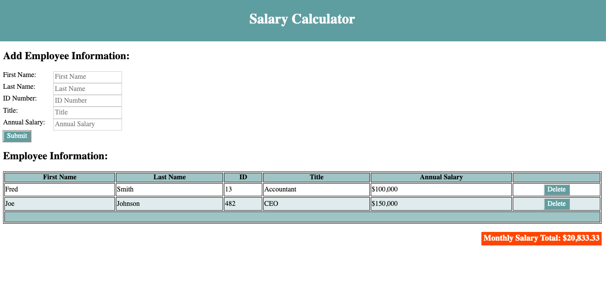

# jQuery Salary Calculator

## Description

Duration: 48 hours - evening 10/2/2020 - evening 10/4/2020

This project is meant to display employee data and calculate a total monthly salary for a company.  The user may add information to input boxes at the top of the screen and, once submitted, this data is transferred as a new line of a table on the screen.  This table also includes a delete button on each line, giving the user the ability to delete the entry from the table on the screen, also removing it from the array that it is stored in, and decreasing the monthly total salary on the screen.

One of the challenges of the project came trying to highlight the section of the screen with the new monthly total amount at the bottom right of the screen.  I was trying to make the background red if the monthly total is above $20,000 and white otherwise.  I was not getting the output and also received errors in the console.  I knew that it needed to be troubleshot closely.  I used a close eye to go line by line and add some logs to the console to see the current output.  I found that I had missed a quote for a string and continued to copy this line and paste it three more times, so the error continued.  By working slowly in small pieces, I was able to fix this.

One other challenge I had was removing the row of the table when delete is clicked.  I used colors on the screen from inside my JavaScript file to change certain elements which were at different levels of the DOM tree to help understand the path I needed to create to remove or select an item.  I was trying to select a different data cell of the table and watched a few videos to learn more about DOM traversal and found one that mentioned .prev() to select a previous sibling of an element on the DOM tree, and this was very helpful.

## Screen Shot

### Prerequisites

- All software is included in the repository here.  I have put a copy of jQuery in the repository
- The project requires an understanding of HTML, CSS, JavaScript and jQuery

## Installation

The project should not require any special installation.  The index.html file may be opened in a text editor and brought up by clicking the right button of the mouse and opening in a favorite or default browser.  

## Usage

1. Data for an employee may be entered in the boxes on the left of the screen, and then submitted by clicking the submit button.
2. To add an employee, all of the input boxes must be filled in or an errer will be created.
3. Once added, an employee may be deleted from the data by clicking the delete button at the end of the row with their information.
4. Each additional employee that is added must have a new ID number.  It will not allow the addition of multiple entries with the same ID number.
5.  Additional employees may be added or deleted as necessary.

## Built With

- HTML
- CSS 
- JavaScript
- jQuery

## Acknowledgment
Thanks to Casie for jQuery instruction!